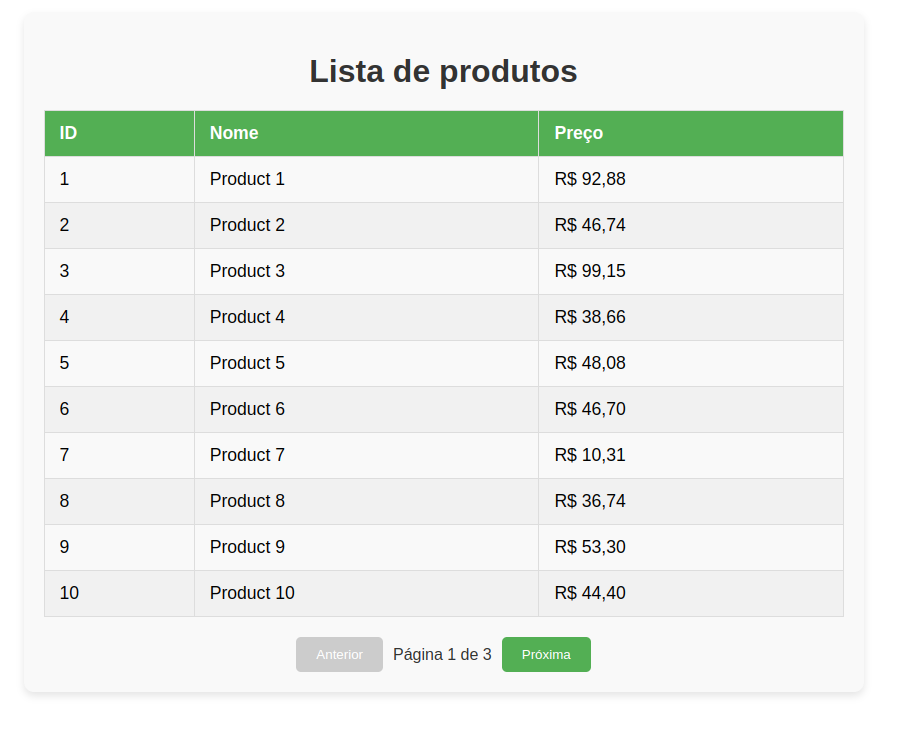

# Listagem de Produtos

Aplicativo de listagem de produtos, com o backend desenvolvido em NestJS e o frontend em ReactJS.



## Requisitos

Antes de começar, você vai precisar ter as seguintes ferramentas instaladas em sua máquina:

- [Node.js](https://nodejs.org/en/)
- [npm](https://www.npmjs.com/)
- [Nest CLI](https://docs.nestjs.com/cli/overview)

## Passo 1: Executar o backend

Entre na pasta /backend e execute:

```bash
npm install
npm run start
```

## Passo 2: Executar o frontend

Entre na pasta /frontend e execute:

```bash
npm install
npm start
